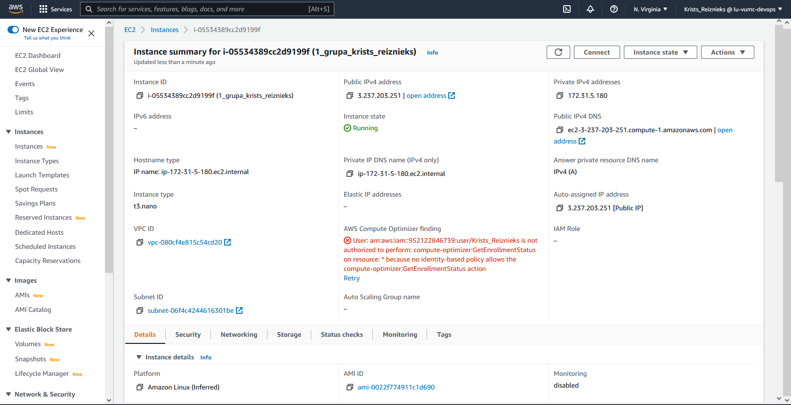

**3. mājasdarbs**  

Ekrānuzņēmums ar servera aprakstu:   

  
**EC2 izvēļņu īss apraksts:**  
  
*Details:*  
Šī izvēlne uzrāda pamatinformāciju par uzstādīto virtuālo mašīnu.  
Izvēlēto operētājsistēmu, uzstādīšanas laiku, AMI informācija.  

*Security:* 
Iespējams uzlikt kadu no izveidotajiem drošības noteikumiem/normām  

*Networking:*  
Iespējams apskatīt kādas ir virtuālās mašīnas piekļuves IP un DNS adreses  

*Storage:*  
Var redzēt cik liels ir datu glabātuves apjoms.  
Var uzlikt jau iepriekš izveidotu "snapshot" ar iestatījumiem lai atjaunotu virtuālo iekārtu  
iepriekšējā stāvoklī  
  
*Status check:*  
Var apskatīt vai ir izietas statusa pārbaudes  
  
*Monitoring:*  
Infopanelis ar virtuālās mašīnas (CPU,diska) un tīkla noslodzēm, kuru iespējams skatīties dažādos laika intervālos

